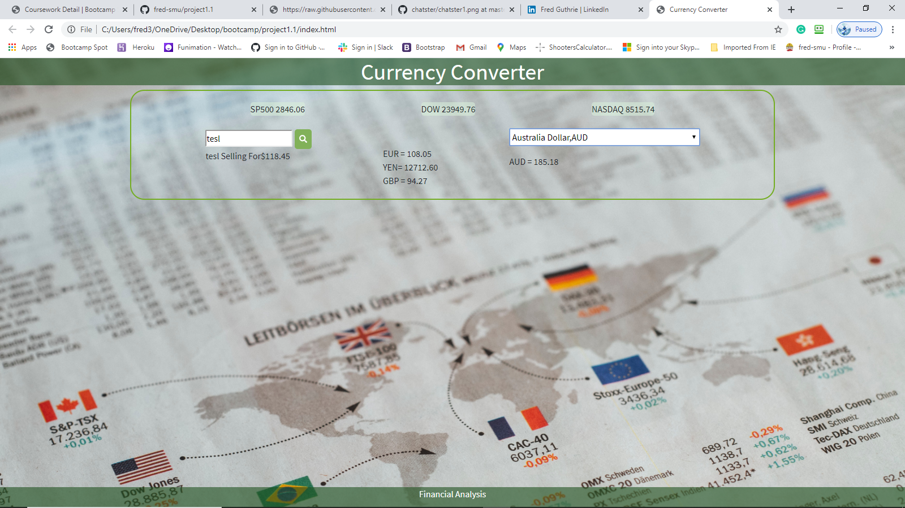

Currency Converter Application

THis is an app designed to convert a stock's price into a country's currency that you choose.
For exaple, when you look up Microsoft, it will return the stock's value in USD and in the Currency Selection box will allow you to select a country of choice to return that country's currency value.

So, if you were in a foreign country and wanted to know how much a stock is trading for in that country, you would search for your stock first and then select your country to see the value in that country's currency.

This is the home page:

This app was designed using the following technologies:

Bootstrap
CSS
HTML
JQuery
Javascript
AJAX
currency.js

Future Use:
There are additional design elements which could be built into the app for future expanded use, such as a charting module, histogram, comparison module, and latest news for the stock.

A copy can be obtained by visiting git@github.com:fred-smu/project1.1.git.
 
Prerequisites

This is a list of things you need to use the software and how to install them:

Bootstrap: https://getbootstrap.com/docs/4.4/getting-started/introduction/
You'll need the bootstrap CDN for CSS, jQuery, Popper.js, and jQuery's slim build. It's usually best to copy and paste the Starter Page example that they provide.

API's: for our api's we used two different api's hosted on https://rapidapi.com/. The first, is yahoo finance at https://rapidapi.com/apidojo/api/yahoo-finance1. The second, is investor's exchange at https://rapidapi.com/eec19846/api/investors-exchange-iex-trading.

Currency.js: we used this library to work with the above api's https://currency.js.org/.

Project Link: https://github.com/fred-smu/project1.1

Team Acknowledgement:
Fred Guthrie: Back-end programming.
Gen Li: Back-end programming.
James Helms: front-end UI design.